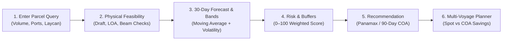

# Product Requirements Document (PRD) — FreightIQ

**Project Name:** FreightIQ  
**Full Title:** FreightIQ — Intelligent Freight Forecasting and Vessel Chartering Decision Platform  
**Target:** Smart India Hackathon (SIH) 2026 — Maritime Procurement Track  
**Scope:** Overseas Bulk Cargo (Coking Coal) Procurement to India's East Coast Ports  

---

## 1. Problem Context

Large Indian steel producers and industrial conglomerates import millions of metric tonnes of metallurgical coking coal annually from overseas origins such as Australia (Newcastle), Indonesia (Kalimantan), Mozambique (Maputo), the United States, and Russia. 

Procurement and chartering managers face critical operational challenges:
1. **Volatile Spot Freight Rates:** Freight rates fluctuate daily based on global bunker prices, fleet availability, and macro swings.
2. **Reactive Spot Contracting:** Organizations frequently rely on daily ad-hoc spot bookings, exposing them to positioning spikes and severe demurrage risk.
3. **Port & Berth Restrictions:** India's East Coast ports (Paradip, Visakhapatnam/Vizag) have strict physical boundaries:
   - Maximum draft (e.g. Paradip Mechanized Coal Berth is limited to 14.5m, while Capesize requires ≥17.5m).
   - Maximum LOA and beam limits.
   - Mechanized cargo handling rates and turnaround times.
4. **The False Economy of "Cheap" Vessels:** A vessel that appears cheaper per metric tonne on paper may be operationally unfeasible or incur higher total costs due to lighterage, deadfreight underutilization, or prolonged queue delays.

---

## 2. Target User & Persona

**Primary Persona:** Logistics / Procurement / Chartering Manager at an Indian industrial bulk importer (e.g., steel manufacturing plant).

**Key Questions the User Needs Answered:**
- *"For this 75,000 MT coking coal parcel from Newcastle to Paradip arriving Oct 10–20, which dry bulk vessel class is physically feasible and economically optimal?"*
- *"Why is Capesize rejected at Paradip while Panamax is recommended?"*
- *"What is the expected freight cost range and uncertainty interval?"*
- *"When is the optimal 18–25 day market entry window to fix the vessel?"*
- *"Is repeated spot booking or a structured 90-day multi-voyage Contract of Affreightment (COA) the better procurement strategy?"*

---

## 3. User Journey

---

## 4. MVP Scope & Boundaries

### Included MVP Scope:
- **Cargo:** Metallurgical Coking Coal
- **Origin Ports:** Port of Newcastle (Australia), Kalimantan Anchorage Port (Indonesia)
- **Destination Ports:** Paradip Port (India), Visakhapatnam / Vizag Port (India)
- **Dry Bulk Vessel Classes:** Handysize (25–40k MT), Supramax (50–60k MT), Panamax/Kamsarmax (65–85k MT), Capesize (120–180k MT)
- **Contract Modes:** Spot Contract, Short-Term Multiple Voyage (90 days / 3–4 voyages), Medium-Term Multiple Voyage (180 days / 6–8 voyages)
- **Future Coverage (Display only in UI):** Maputo (Mozambique), Hampton Roads (USA), Vostochny (Russia), Haldia (India), Dhamra (India), Ennore (India).

### Product Non-Goals (What FreightIQ is NOT):
- NOT a live ship-brokerage booking or transaction engine.
- NOT a digital contract signing or payment platform.
- NOT a real-time satellite AIS vessel tracker.
- NOT a black-box deep learning system with unexplainable predictions.
- No live external API dependencies during local evaluation; runs fully local-first with deterministic prototype seed datasets.

---

## 5. Success Criteria & KPIs

1. **Physical Accuracy:** 100% adherence to port draft and dimensional restrictions (e.g., Capesize draft of 17.5m must be flagged as `REJECTED` at Paradip with draft limit 14.5m).
2. **Transparent Provenance:** Every metric displays its origin badge (`User Input`, `Official-source Prototype Configuration`, `Sample Historical Prototype Data`, `Simulated Scenario Data`, `Prototype Assumption`).
3. **Quantitative Financial Comparison:** Generates side-by-side cost and reliability breakdowns for Repeated Spot vs Multi-Voyage COA.
4. **Execution Speed:** Fast local startup with sub-second API response times and zero compilation warnings.
